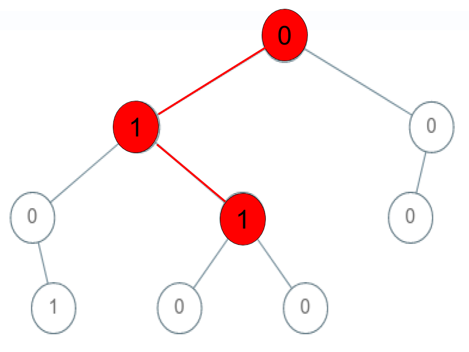

### Check If a String Is a Valid Sequence from Root to Leaves Path in a Binary Tree
#### Writer: Hyungjune Shin
#### Refer: LeetCode 
* * *
### Problem

주어진 이진트리에서 valid sequence란 root부터 leaf 노드까지의 값의 순열을 지칭합니다. 주어진 Integer 배열이 있을 때, 해당 배열이 valid sequence를 만족시키는지를 확인하는 프로그램을 작성하는 문제입니다.

<b>Example 1</b>
<pre>

<b>Input</b>: root = [0,1,0,0,1,0,null,null,1,0,0], arr = [0,1,0,1]
<b>Output</b>: true
<b>Explanation</b>: 0->1->0->1은 valid sequence (그림에서 녹색) 입니다.
다른 valid sequence들은 다음과 같습니다:
0->1->1->0
0->0->0
</pre>

<b>Example 2</b>
<pre>

<b>Input</b>: root = [0,1,0,0,1,0,null,null,1,0,0], arr = [0,0,1]
<b>Output</b>: false
<b>Explanation</b>: 0->0->1 이라는 경로가 존재하지 않습니다. 그러므로 sequence가 아닙니다.
</pre>

<b>Example 3</b>
<pre>

<b>Input</b>: root = [0,1,0,0,1,0,null,null,1,0,0], arr = [0,1,1]
<b>Output</b>: false
<b>Explanation</b>: 0->1->1은 sequence이지만 leaf node에 도달해있지 않으므로 valid sequence는 아닙니다.
</pre>

<b>Constraints:</b>
- 1 <= arr.length <= 5000
- 0 <= arr[i] <= 9
- 노드의 값은 [0-9] 사이입니다.

* * *
### Solution
```go
/**
 * Definition for a binary tree node.
 * type TreeNode struct {
 *     Val int
 *     Left *TreeNode
 *     Right *TreeNode
 * }
 */
func isValidSequence(root *TreeNode, arr []int) bool {
    if root == nil && len(arr) != 0{
        return false
    }
    if root != nil && len(arr) == 1 {
        if root.Left == nil && root.Right == nil {
            return root.Val == arr[0]
        } else {
            return false
        }
    }
    if root.Val != arr[0] {
        return false
    } else {
        return true && (isValidSequence(root.Left, arr[1:]) || isValidSequence(root.Right, arr[1:]))
    }
}
```
- valid sequence 정의에 의해 subtree와 subarr에서도 valid sequence가 적용됩니다.
- 가장 기저가 되는 부분은 root.Val != arr[0]입니다. 이때는 false를 반환합니다.
- 만약에 root.Val가 arr[0]와 같다면 root를 제외한 subtree와 arr[0]를 제외한 subarr을 넣고 validSequence인지를 확인하면 됩니다.
