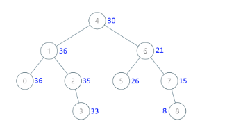

#### 1038. Binary Search Tree to Greater Sum Tree
#### Writter: Donggyu Cho
#### Refer: LeetCode

## 문제설명
Given the root of a binary search tree with distinct values, modify it so that every node has a new value equal to the sum of the values of the original tree that are greater than or equal to node.val.


<b>Example 1</b>
<pre>

<b>Input</b>: [4,1,6,0,2,5,7,null,null,null,3,null,null,null,8]
<b>Output</b>: [30,36,21,36,35,26,15,null,null,null,33,null,null,null,8]
</pre>

<b>Constraints</b>
<pre>
<b> node의 개수는 1~100 사이이다. </b>
<b> 각 노드는 0~100 사이의 값을 갖는다. </b>
<b> 주어진트리는 이진 탐색 트리이다. </b>
</pre>

* * *
### Solution
```go
type BSTreeNode struct {
	Val  int
	Node *TreeNode
}

type BSTree struct {
	nodes []*BSTreeNode
}

func bstToGst(root *TreeNode) *TreeNode {

	var bsTree *BSTree
	var s *Stack
	bsTree = &BSTree{}
	s = &Stack{}

	BFSsearch(root, s, bsTree)

    sort.Slice(bsTree.nodes, func(i, j int) bool {
		return bsTree.nodes[i].Val < bsTree.nodes[j].Val
	})
	//quicksort(bsTree.nodes)

	FactorialAndResetValue(bsTree)

	return root
}

// func quicksort(nodes []*BSTreeNode) []*BSTreeNode {
// 	if len(nodes) < 2 {
// 		return nodes
// 	}

// 	left, right := 0, len(nodes)-1

// 	pivot := rand.Int() % len(nodes)

// 	nodes[pivot], nodes[right] = nodes[right], nodes[pivot]

// 	for i, _ := range nodes {
// 		if nodes[i].Val < nodes[right].Val {
// 			nodes[left], nodes[i] = nodes[i], nodes[left]
// 			left++
// 		}
// 	}

// 	nodes[left], nodes[right] = nodes[right], nodes[left]

// 	quicksort(nodes[:left])
// 	quicksort(nodes[left+1:])

// 	return nodes
// }

func FactorialAndResetValue(bsTree *BSTree) {
	i := len(bsTree.nodes) - 1
	for {
		if i == 0 {
			return
		}
		bsTree.nodes[i-1].Val += bsTree.nodes[i].Val
		bsTree.nodes[i-1].Node.Val = bsTree.nodes[i-1].Val
		i--
	}
}

func BFSsearch(root *TreeNode, s *Stack, bsTree *BSTree) *TreeNode {
	if root == nil {
		return nil
	}

	bsTree.nodes = append(bsTree.nodes, &BSTreeNode{
		Val:  root.Val,
		Node: root,
	})

	if root.Left != nil {
		s.Push(root.Left)
	}
	if root.Right != nil {
		s.Push(root.Right)
	}

	return BFSsearch(s.Pop(), s, bsTree)
}


type Stack struct {
	arr   []*TreeNode
	count int
}

func (s *Stack) Push(node *TreeNode) {
	s.arr = append(s.arr[:s.count], node)
	s.count++
}

func (s *Stack) Pop() *TreeNode {
	if s.count == 0 {
		return nil
	}
	s.count--
	return s.arr[s.count]
}
```

### 접근법
1. 각 Tree노드의 Val 값과 그 노드의 주소를 저장하는 BSTreeNode 정의 
2.Tree의 값을 모두 탐색
2.1 BFS 방식으로 탐색
2.2 탐색을 하며 현재 Tree의 값을 통해 BSTree를 구성
2.3 BSTree는 배열로 구현
3. BSTree의 노드들을 Sorting
3.1 BSTree에는 모든 TreeNode의 정보가 저장되어있는 상태.
3.2 각 BSTreeNode의 값을 기준으로 오름차순으로 Sorting
3.3 QuickSort 구현을 직접 해봄. 굳이 quicksort를 사용하지 않고 golang 기본 library를 사용해도 동일함(내부적으로 quicksort가 구현되어있음)
4. BSTree 노드들의 value를 Factorial 방식으로 변경
4.1 변경과 동시에 저장하고 있던 TreeNode 포인터를 통해 TreeNode의 Value의 값도 변경
5. 결과값 출력
